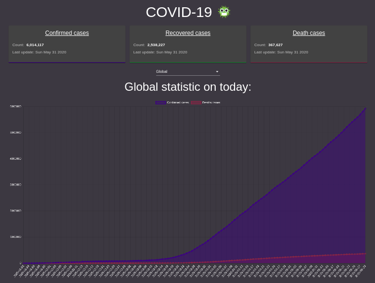
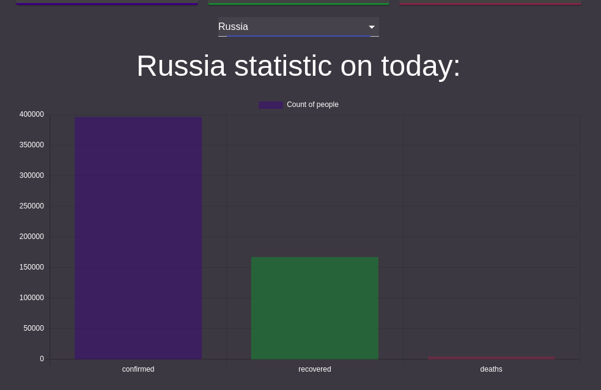

# Covid-19 monitoring app

## Used

1. React
2. Redux
3. TypeScript
4. Axios
5. Chart.js
6. CountUp.js
7. Redux thunk
8. Material UI

## App features

1. Show confirmed, recovered and death cases on today
2. Make charts on global statistics
3. Choosing individual country
4. Show cases in charts for individual country

## Screenshots

_Main_

_Individual country_

